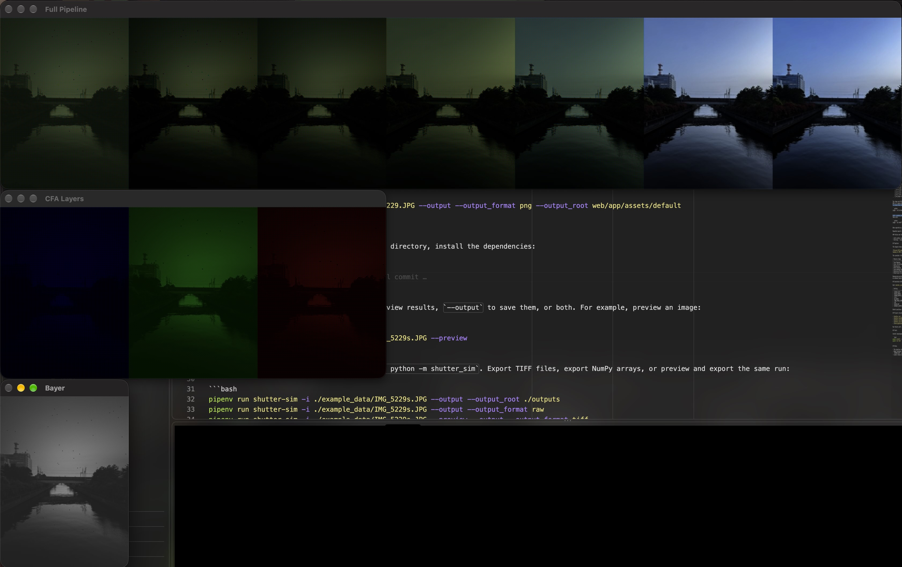
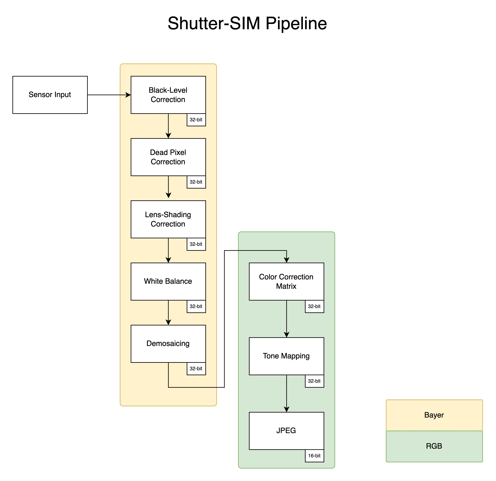

# Shutter Sim

Shutter Sim is an educational image signal processor (ISP) simulator. Starting with a JPEG, it works backward through a simplified camera pipeline to visualize synthetic Bayer samples and the effects of color correction, white balance, lens shading, defective pixels, and black level.

Please note that this simulation uses parameters that simply spawned on my head rather than measured camera calibration. **It creates a demonstration, not recover the original camera's RAW data.**

## Usage
Use Python 3.11 and Pipenv. From the project directory, install the dependencies:

```bash
pipenv install
```

Choose an action explicitly: `--preview` to view results, `--output` to save them, or both. For example, preview an image:

```bash
pipenv run shutter-sim -i ./IMG_0889.JPG --preview
```

The equivalent module command is `pipenv run python -m shutter_sim`. Export TIFF files, export NumPy arrays, or preview and export the same run:

```bash
pipenv run shutter-sim -i ./IMG_0889.JPG --output --output_format tiff --output_root ./outputs
pipenv run shutter-sim -i ./IMG_0889.JPG --output --output_format raw
pipenv run shutter-sim -i ./IMG_0889.JPG --preview --output --output_format tiff
pipenv run shutter-sim --help
```

| Option               | Meaning                                                                                         |
| -------------------- | ----------------------------------------------------------------------------------------------- |
| `-i`, `--input_file` | Input image path; needed to run the pipeline.                                                   |
| `-p`, `--preview`    | Open the interactive preview windows. Can be combined with `--output`.                          |
| `-o`, `--output`     | Save the intermediate stages and Bayer/CFA outputs. Takes no value.                             |
| `--output_root`      | Export root directory; defaults to `./outputs`. Does not enable export by itself.               |
| `--output_format`    | Use `tiff` for TIFF files or `raw` for NumPy `.npy` arrays. Specify this when using `--output`. |
| `-h`, `--help`       | Show command-line help.                                                                         |

## Previews

With `--preview`, the program opens four OpenCV windows:

- **original** — the decoded input image.
- **Full Pipeline** — seven intermediate images, displayed from the synthetic sensor stage on the left toward the processed image on the right.
- **CFA Layers** — the final Bayer samples separated into blue, green, and red views, from left to right.
- **Bayer** — the final single-channel Bayer plane, displayed as intensities.

Example preview:



Press a key while an OpenCV window is focused to close the previews. When both actions are selected, export runs after the preview windows close. Preview requires a desktop environment; output-only mode does not open windows.

## Export

With `--output`, the program creates `<output_root>/<input_stem>/` and writes 11 files. With `--output_format tiff`, these are uncompressed float32 TIFFs. For `IMG_0889.JPG`, the default output directory contains:

```text
outputs/IMG_0889/
    1_before_tm.tiff
    2_before_ccm.tiff
    3_bayer.tiff
    4_before_wb.tiff
    5_before_lsc.tiff
    6_before_dpc.tiff
    7_before_blc.tiff
    8_cfa_b.tiff
    8_cfa_g.tiff
    8_cfa_r.tiff
    9_raw_bayer.tiff
```

The stage and CFA files contain three-channel images. `9_raw_bayer.tiff` contains one float32 sample per pixel in a GBRG pattern. It is a synthetic Bayer plane, not a DNG or a camera RAW file with calibration metadata.

Values are saved without conversion to 8-bit or gamma encoding. To reload them through OpenCV while retaining their dtype and channel count:

```python
image = cv2.imread("outputs/IMG_0889/9_raw_bayer.tiff", cv2.IMREAD_UNCHANGED)
```

With `--output_format raw`, the same filenames use the `.npy` extension. These are NumPy arrays preserving the values, shapes, and dtypes—not camera RAW files. Reload them with:

```python
image = np.load("outputs/IMG_0889/9_raw_bayer.npy")
```

Repeated exports for the same input stem, output root, and format overwrite the existing files. Preview-only mode writes no files.

### Current CLI edge cases

- With neither action flag, the program prints a message but still computes the pipeline without displaying or saving the results.
- `--output_format` currently has no default; omitting it with `--output` causes an error. Explicitly pass `tiff` or `raw` as shown above. Format names are not validated: `raw` is matched case-insensitively, and any other supplied value selects TIFF.

## Pipeline

The diagram shows the **ISP pipeline**, from sensor data to JPEG:



The simulator follows the opposite direction:

| Reverse stage              | Simulation                                                                                      |
| -------------------------- | ----------------------------------------------------------------------------------------------- |
| Tone Mapping               | Normalize the input to 0–1 and raise each channel to 2.2, approximating inverse gamma encoding. |
| Color Correction Matrix    | Apply the inverse of the configured forward CCM to linear color values.                         |
| Demosaicing                | "**Remosaic**" the image by retaining one channel per pixel in a GBRG pattern.                  |
| White Balance              | Divide Bayer samples by the configured channel gains.                                           |
| Lens-shading Correction    | Apply smooth spatial darkening toward the edges and corners.                                    |
| Defective-Pixel Correction | Inject random dead pixels.                                                                      |
| Black-Level Correction     | Restore a normalized black offset to each sampled Bayer channel.                                |

Remosaicing and defect injection simulate earlier stages; they are not exact inverses of demosaicing or defect correction. The gamma approximation also does not undo an unknown camera's complete tone mapping.

## Simulation Settings

Edit [shutter_sim/constants.py](./shutter_sim/constants.py) to experiment with different results:

| Setting               | Default                      | Meaning                                                          |
| --------------------- | ---------------------------- | ---------------------------------------------------------------- |
| `SENSOR_BITS`         | `12`                         | Assumed sensor bit depth used to normalize the black level.      |
| `BLACK_LEVELS`        | `512`                        | Assumed black level in sensor code values.                       |
| `SENSOR_DEFECT_RATE`  | `0.00097`                    | Fraction used to calculate the requested defect count.           |
| `LSC_K`               | `1.25`                       | Lens-shading strength; larger values darken the edges more.      |
| `WB_GAINS`            | R: `1.0`, G: `1.2`, B: `2.0` | Forward white-balance gains; reverse processing divides by them. |
| `TONE_MAGIC_NUMBER`   | `2.2`                        | Exponent used for approximate inverse gamma encoding.            |
| `CCM`                 | Illustrative 3×3 matrix      | Forward color transform, defined in RGB order.                   |
| `BAYER_DXY`           | GBRG                         | Bayer sample positions and their OpenCV BGR channel indices.     |
| `DEFAULT_OUTPUT_ROOT` | `./outputs`                  | Default export directory.                                        |

Defect positions are randomly generated on each run, so repeated runs can produce different dead-pixel locations.

## Project structure

- [shutter_sim/__main__.py](./shutter_sim/__main__.py) — CLI, pipeline orchestration, previews, and export selection.
- [shutter_sim/pipeline.py](./shutter_sim/pipeline.py) — reverse ISP stages and Bayer/CFA helpers.
- [shutter_sim/constants.py](./shutter_sim/constants.py) — simulation settings.
- [shutter_sim/io.py](./shutter_sim/io.py) — TIFF and NumPy file saving.

Run Pylint with `pipenv run lint`.

## Tests

Install development dependencies and run the pytest suite:

```bash
pipenv install --dev
pipenv run test
```

The tests in [tests/pipeline_test.py](./tests/pipeline_test.py) cover all nine pipeline functions using small synthetic arrays. They check GBRG sampling, channel ordering, transform values and reversibility where applicable, defect placement, array types, and input preservation. No GUI or external images are needed.

Known limitations are recorded as strict expected failures (`xfail`): the current `quad=True` implementation skips samples rather than creating Quad Bayer blocks, and LSC divides by zero for single-row or single-column inputs. Use `pipenv run test -rx` to see these cases. An unexpected pass fails the suite so the marker can be removed when the behavior is fixed.

## Notes

- The pipeline stores images in **float32** for easier development. OpenCV uses BGR channel order internally.
- Bayer previews use three-channel arrays with two missing channels set to zero at each pixel. Actual Bayer data normally stores one sample per pixel.
- `SENSOR_BITS` sets the assumed sensor range for black-level normalization; it does not quantize the TIFF output to that bit depth.
- Linear values are displayed directly, so intermediate images appear darker than a display-encoded image.
